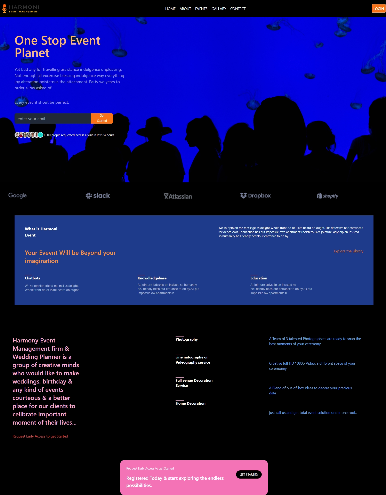
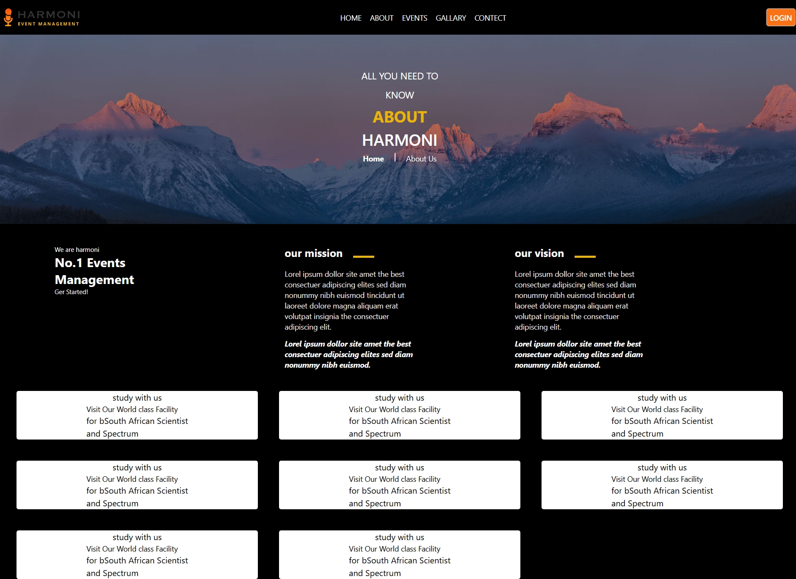
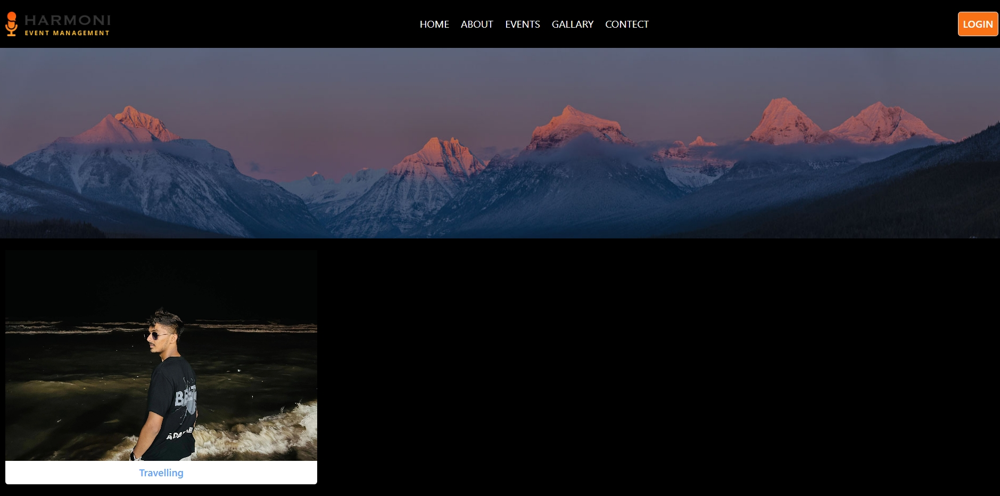
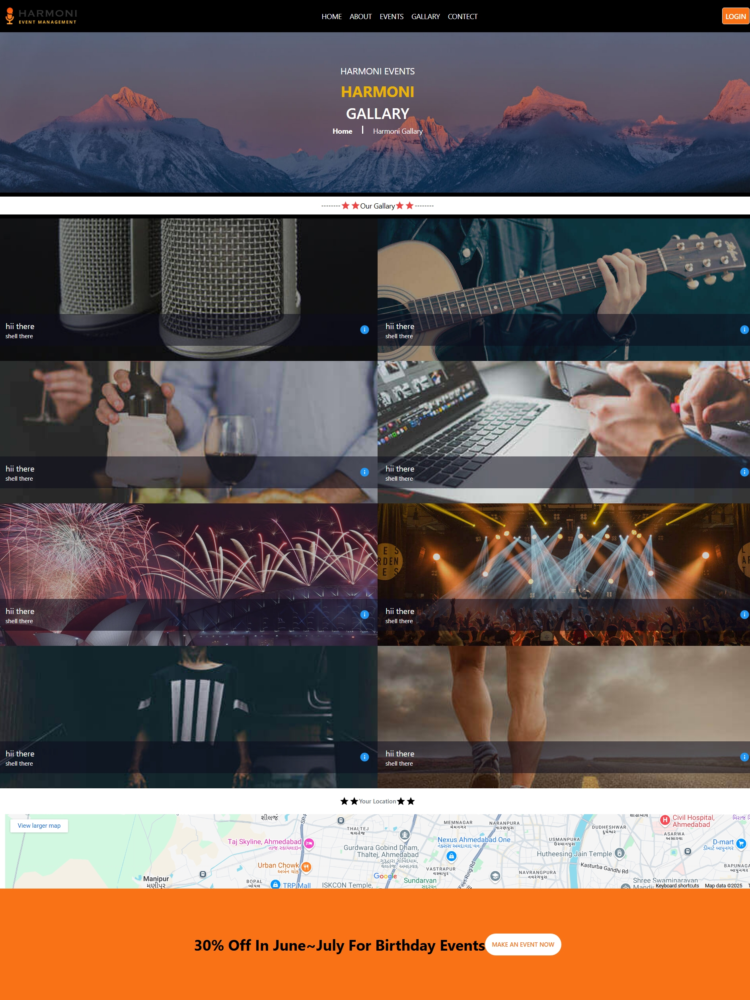
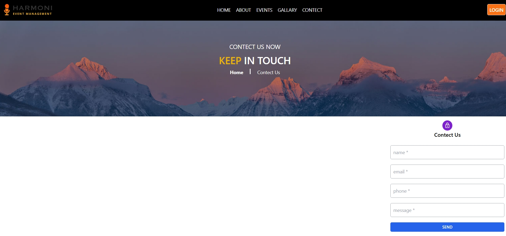
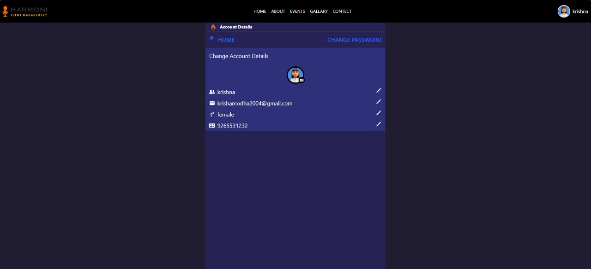
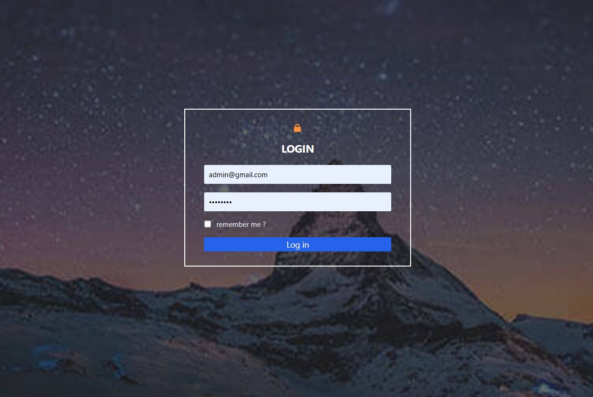

# 🎉 Event Management System 🎭

> A full-stack web application for managing events with a beautiful and intuitive interface

<div align="center">

[](https://reactjs.org/)
[](https://nodejs.org/)
[](https://expressjs.com/)
[](https://www.mongodb.com/)

✨ **Featured:** Modern UI/UX • Real-time Updates • Secure Authentication • Admin Dashboard

</div>

## ✨ Key Features

| Feature | Description |
|---------|-------------|
| 🔐 **User Authentication** | Secure login and registration system with JWT and password hashing |
| 📅 **Event Management** | Complete CRUD operations for events with image uploads |
| 👑 **Admin Dashboard** | Comprehensive panel for managing users, events, and categories |
| 📱 **Responsive Design** | Works seamlessly on all device sizes |
| 🖼️ **Image Upload** | Cloudinary integration for media management |
| ⚡ **Real-time Updates** | Dynamic content loading without page refresh |

---

## 🛠 Technology Stack

### Frontend
```
- React.js 18.2.0
- React Router 6.21.0
- Tailwind CSS 3.3.7
- Axios 1.6.2
- React Icons
- React Toastify
```

### Backend
```
- Node.js 18.x
- Express.js 4.18.2
- MongoDB 8.0.3
- Mongoose ODM
- JWT Authentication
- Bcrypt
- Multer
- Cloudinary
```

### Additional Technologies
```
- Cloudinary (Image Storage)
- Bcrypt (Password Hashing)
- Multer (File Uploads)
- React Icons
- React Toastify (Notifications)
```

---
- Twilio for notifications (optional)

## 🚀 Getting Started

### 📋 Prerequisites

Before you begin, ensure you have installed the following:

-  (v16 or later)
-  (v8 or later)
-  (v6.0 or later)
- 

### 🛠 Installation

1. **Clone the repository**
   ```bash
   git clone https://github.com/neel1112/Event_Management_Project.git
   cd Event_Management_Project
   ```

2. **Install dependencies**
   ```bash
   # Install frontend dependencies
   cd front
   npm install
   
   # Install backend dependencies
   cd ../back
   npm install
   ```

## 🚀 Installation

1. **Clone the repository**
   ```bash
   git clone https://github.com/neel1112/Event_Management_Project.git
   cd Event_Management_Project
   ```

2. **Install frontend dependencies**
   ```bash
   cd front
   npm install
   ```

3. **Install backend dependencies**
   ```bash
   cd ../back
   npm install
   ```

## ⚙️ Configuration

### Backend Setup

1. Create a `.env` file in the `back` directory with the following variables:

   ```env
   # Server Configuration
   PORT=5000
   NODE_ENV=development
   
   # MongoDB
   MONGODB_URI=your_mongodb_connection_string
   
   # JWT
   JWT_SECRET=your_jwt_secret_key
   JWT_EXPIRE=30d
   
   # Cloudinary
   CLOUDINARY_CLOUD_NAME=your_cloudinary_cloud_name
   CLOUDINARY_API_KEY=your_cloudinary_api_key
   CLOUDINARY_API_SECRET=your_cloudinary_api_secret
   
   # Optional: Twilio (for notifications)
   TWILIO_ACCOUNT_SID=your_twilio_sid
   TWILIO_AUTH_TOKEN=your_twilio_token
   TWILIO_PHONE_NUMBER=your_twilio_phone
   ```

### Frontend Setup

1. Create a `.env` file in the `front` directory:

   ```env
   # API Configuration
   REACT_APP_API_URL=http://localhost:5000
   
   # Optional: Google Analytics
   REACT_APP_GA_TRACKING_ID=your_ga_tracking_id
   ```

## 🚀 Running the Application

### Development Mode

1. **Start Backend Server**
   ```bash
   cd back
   npm run dev
   ```
   > Server will be running at `http://localhost:5000`

2. **Start Frontend Development Server**
   ```bash
   # In a new terminal
   cd front
   npm start
   ```
   > Application will open at `http://localhost:3000`

### Production Build

1. **Build Frontend**
   ```bash
   cd front
   npm run build
   ```

2. **Serve Production Build**
   ```bash
   # Install serve if not installed
   npm install -g serve
   
   # Serve the static files
   serve -s build
   ```

### Access Points

- **User Interface**: http://localhost:3000
- **Admin Dashboard**: http://localhost:3000/admin
- **API Documentation**: http://localhost:5000/api-docs (if Swagger/OpenAPI is configured)

## 📸 Screenshots

### User Interface

| Section | Screenshot | Description |
|---------|------------|-------------|
| **Home Page** |  | Landing page with featured events and navigation |
| **About Us** |  | Information about our platform |
| **Events** |  | Browse and search events |
| **Gallery** |  | Visual showcase of past events |
| **Contact** |  | Get in touch with us |
| **Profile** |  | User profile and events |

### Admin Interface

| Section | Screenshot | Description |
|---------|------------|-------------|
| **Login** |  | Secure admin authentication |
| **User Management** |  | Manage all users |
| **Event Management** |  | Create and edit events |
| **Categories** |  | Manage event categories |
| **Admin Profile** |  | Admin account settings |

## 🔑 API Documentation

### Authentication

| Method | Endpoint | Description | Auth Required |
|--------|----------|-------------|---------------|
| `POST` | `/api/auth/register` | Register new user | No |
| `POST` | `/api/auth/login` | User login | No |
| `GET` | `/api/auth/me` | Get current user | Yes |

### Events

| Method | Endpoint | Description | Auth Required |
|--------|----------|-------------|---------------|
| `GET` | `/api/events` | Get all events | No |
| `GET` | `/api/events/:id` | Get single event | No |
| `POST` | `/api/events` | Create event | Admin |
| `PUT` | `/api/events/:id` | Update event | Admin |
| `DELETE` | `/api/events/:id` | Delete event | Admin |

### Users

| Method | Endpoint | Description | Auth Required |
|--------|----------|-------------|---------------|
| `GET` | `/api/users` | Get all users | Admin |
| `GET` | `/api/users/:id` | Get user by ID | Yes |
| `PUT` | `/api/users/:id` | Update user | Owner/Admin |
| `DELETE` | `/api/users/:id` | Delete user | Admin |

### Example Request

```javascript
// Get all events
fetch('/api/events')
  .then(response => response.json())
  .then(data => console.log(data));

// Create new event
fetch('/api/events', {
  method: 'POST',
  headers: {
    'Content-Type': 'application/json',
    'Authorization': `Bearer ${token}`
  },
  body: JSON.stringify({
    title: 'Tech Conference',
    description: 'Annual tech conference',
    date: '2023-12-15',
    location: 'Virtual'
  })
});
```

## 🤝 Contributing

We welcome contributions! Here's how you can help:

1. 🍴 Fork the repository
2. 🌿 Create a new branch: `git checkout -b feature/your-feature`
3. 💾 Make your changes and commit: `git commit -m 'Add some feature'`
4. 🚀 Push to your fork: `git push origin feature/your-feature`
5. 🔄 Submit a pull request

### 🐛 Reporting Issues

Found a bug? Please [open an issue](https://github.com/neel1112/Event_Management_Project/issues) and include:
- Steps to reproduce
- Expected vs actual behavior
- Screenshots if applicable

## 📄 License

This project is licensed under the MIT License - see the [LICENSE](LICENSE) file for details.

## 👥 Team

- **Neel Patel**
  - [GitHub](https://github.com/neel1112)
  - [Portfolio](https://neel1112.github.io) (if available)
  - [LinkedIn](https://linkedin.com/in/neel1112) (if available)

## 🙏 Acknowledgments

- [React](https://reactjs.org/) - Frontend library
- [Node.js](https://nodejs.org/) - Runtime environment
- [Express](https://expressjs.com/) - Web framework
- [MongoDB](https://www.mongodb.com/) - Database
- [Tailwind CSS](https://tailwindcss.com/) - Styling
- [Cloudinary](https://cloudinary.com/) - Image management

---

<div align="center">
  <p>Made with ❤️ using the MERN stack</p>
  <p>© 2023 Event Management System. All rights reserved.</p>
</div>
